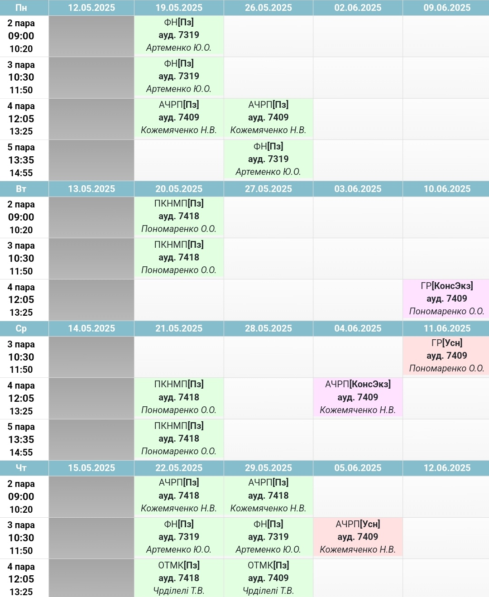
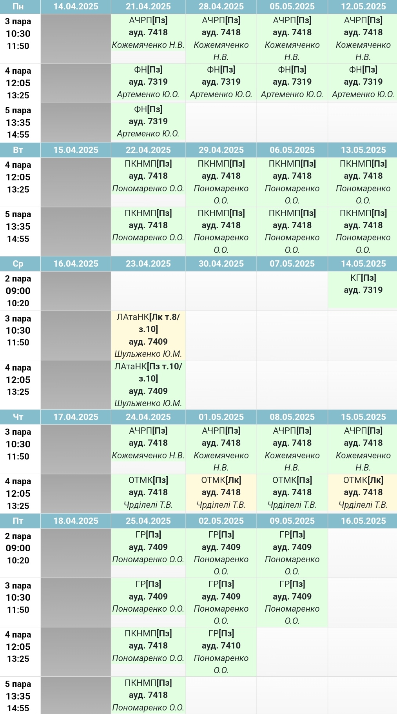

<h2>Розклад</h2>

    
<strong>Перша підгрупа</strong>

    

    
<strong>Друга підгрупа</strong>

    

---

<h2>Домашнє завдання</h2>

    
<strong>Спільне</strong>

    <strong>ОТМК</strong>  

    Зробити розбір діалогу з англійської літератури (якщо ще не здано)

    Пройти курс на <a href="http://krnu.org/mod/assign/view.php?id=21314">прометеус</a>  

---

    <strong>Література</strong>  
    Виконати завдання в телеграмі в группі з куратором

  <ul>
    <li><a href="subgroup1">Перша підгрупа</a></li>
    <li><a href="subgroup2">Друга підгрупа</a></li>
  </ul>

---

<h2>Курси на мудл</h2>

<ul>
  <li><a href="http://krnu.org/course/view.php?id=1573">АЧРП</a></li>
  <li><a href="http://krnu.org/course/view.php?id=885">Граматика</a></li>
  <li><a href="http://krnu.org/course/view.php?id=1788">Німецька</a></li>
  <li><a href="http://krnu.org/course/view.php?id=44">Фонетика</a></li>
  <li><a href="http://krnu.org/course/view.php?id=796">ОТМК</a></li>
  <li><a href="http://krnu.org/course/view.php?id=1571">Література</a></li>
</ul>

---

<h2>Посилання на Zoom</h2>

<ul>
  <li><a href="http://krnu.org/mod/url/view.php?id=29123">АЧРП</a></li>
  <li><a href="http://krnu.org/mod/url/view.php?id=29200">Граматика</a></li>
  <li><a href="http://krnu.org/mod/url/view.php?id=29221">Німецька</a></li>
  <li><a href="http://krnu.org/mod/url/view.php?id=45463">Фонетика</a></li>
  <li><a href="http://krnu.org/mod/url/view.php?id=29313">ОТМК</a></li>
  <li><a href="http://krnu.org/mod/url/view.php?id=24220">Література</a></li>
</ul>
