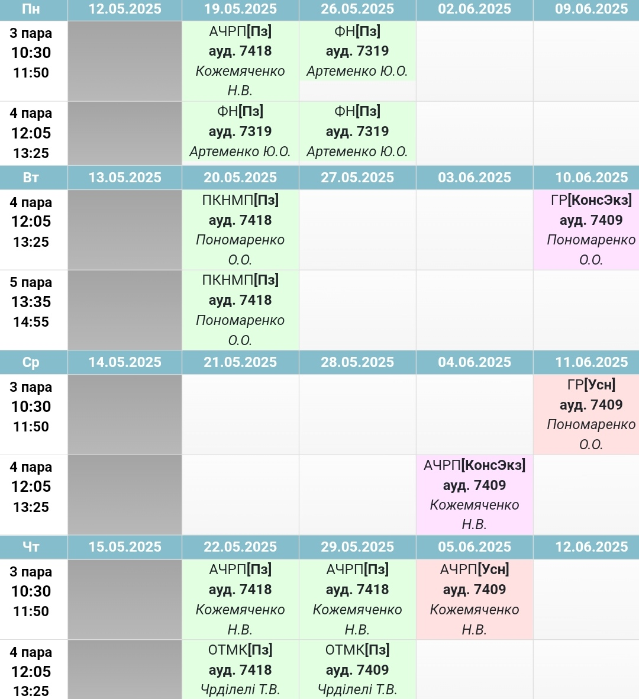

## Розклад

    
 **Перша підгрупа** 

        

    
 **Друга підгрупа** 

        

## Домашнє завдання

    
 **Спільне** 

        ### ОТМК

        ### Література

[Перша підгрупв](subgroup1/home_assignment.md)  
[Друга підгрупа](subgroup2/home_assignment.md)    

## Курси ну мудл

[АЧРП](http://krnu.org/course/view.php?id=1573)  
[Граматика](http://krnu.org/course/view.php?id=885)  
[Німецька](http://krnu.org/course/view.php?id=1788)  
[Фонетика](http://krnu.org/course/view.php?id=44)  
[ОТМК](http://krnu.org/course/view.php?id=796)  
[Література](http://krnu.org/course/view.php?id=1571)    

## Посилання на Zoom

[АЧРП](http://krnu.org/mod/url/view.php?id=29123)  
[Граматика](http://krnu.org/mod/url/view.php?id=29200)  
[Німецька](http://krnu.org/mod/url/view.php?id=29221)  
[Фонетика](http://krnu.org/mod/url/view.php?id=45463)  
[ОТМК](http://krnu.org/mod/url/view.php?id=29313)  
[Література](http://krnu.org/mod/url/view.php?id=24220)
