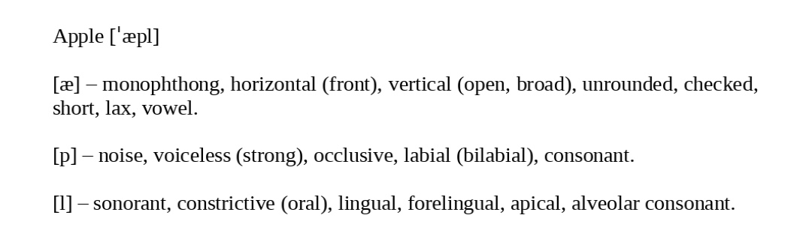

<h2>Друга підгрупа</h2>

<strong>АЧРП</strong>  

Подивитись ці 2 відео

  <strong>15-ГО ТРАВНЯ</strong>  

Зробити презентацію Exploring the city (про Кременчук), 10 змістовних слів на речення (для розповіді)
Використовувати фрази з TASK 6 в Traveling Set    

<strong>19-ГО ТРАВНЯ</strong>  

Зробити самостійну роботу з книги 10 сторінок роздрукувати (собі зробити переклад) та попрактикуватись читати та перекладати (і зробити аналіз тексту)

---

<strong>Граматика</strong>  

Закріпити знання з <a href="">nouns</a>

---

<strong>Німецька</strong>  

Вивчити 3 словника "wörterbuch" (всі словники в групі з куратором)    

Вивчити ці 2 діалоги
 
 

---

<strong>Фонетика</strong>  

Розібрати слово (яке вам давали) по цьому прикладу нижче (писати на листочку)

<a href="https://drive.google.com/drive/mobile/folders/1wS6gswOli-StjoNAvlZ7RwPoZV7mU7x8">Аудіо</a> до завдань [s, z] t. 7, p. 118, t. 8, 9, 10, p. 119, t. 7, 8, p. 121  
<strong>Tongue-twister(task 8) обов'язково</strong>

  Пройти ВСІ тести

  Вивчити 100 нових англійських фраз з фільмів або YouTube-каналів, засвоївши їх значення

