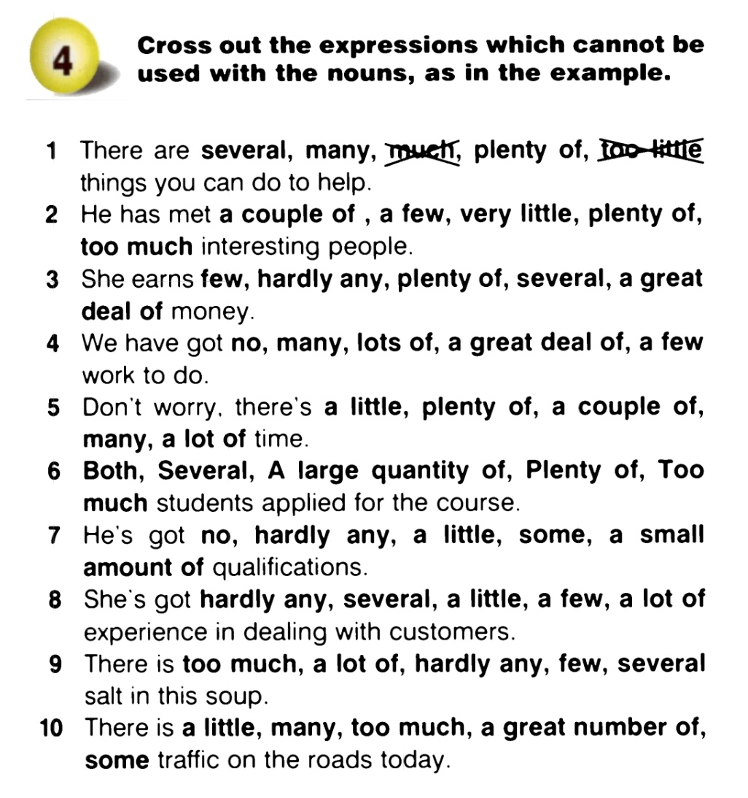
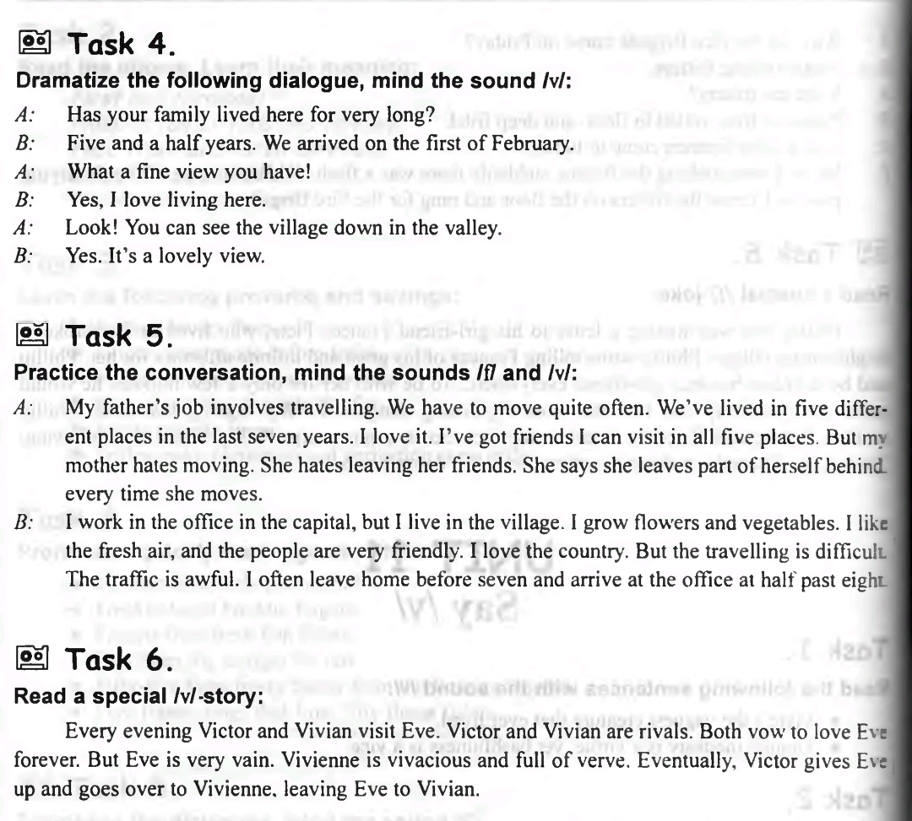

<h2>Друга підгрупа</h2>

<strong>АЧРП</strong>  

Зробити презентацію Exploring the city (про Кременчук)  
10 змістовних слів на речення  
Використовуючи фрази з TASK 6 в Traveling Set

---

<strong>Граматика</strong>  

 

---

<strong>Німецька</strong>  

 

---

<strong>Фонетика</strong>  

Розібрати голосну (зі слова яке вам давали) по цьому <a href="http://krnu.org/mod/resource/view.php?id=25308">прикладу<a/>  

Пройти <a href="http://krnu.org/mod/quiz/view.php?id=506">тест</a>  
<a href="https://drive.google.com/drive/mobile/folders/1wS6gswOli-StjoNAvlZ7RwPoZV7mU7x8">Аудіо</a> до завдань CD1/2.mp3 15:10 та 17:10

